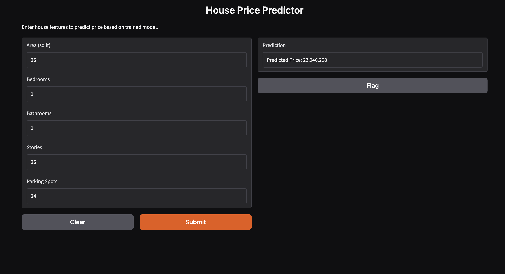

# House Price Predictor

Predicts house prices using Linear Regression, Lasso, and Ridge regression, with a Gradio UI for interactive predictions.

## Overview

This project uses the [Housing Prices Dataset](https://www.kaggle.com/datasets/yasserh/housing-prices-dataset) from Kaggle to build and compare regression models for predicting house prices based on features like area, bedrooms, bathrooms, stories, and parking.

## Demo



## Project Steps

1. **EDA** — explored feature distributions, correlation heatmap, and checked for multicollinearity
2. **Modeling** — trained and compared Linear Regression, Lasso, Ridge, and Random Forest Regressor
3. **Model Selection** — automatically selected the best-performing model based on R² score
4. **Deployment** — built a Gradio web interface for live predictions

## Results

| Model | R² | RMSE |
|---|---|---|
| Linear Regression | ~0.565 | ~1,354,666 |
| Lasso | ~0.565 | ~1,354,666 |
| Ridge | ~0.564 | ~1,356,469 |
| Random Forest | ~0.451 | ~1,522,112 |

Numeric features alone explain ~56% of price variance. Categorical features (e.g. air conditioning, preferred area) are a likely next step to improve performance.

## Setup

```bash
pip install -r requirements.txt
```

## Usage

Run the Gradio app:

```bash
python app.py
```

Or open `notebook.ipynb` to see the full EDA, model training, and comparison process.

## Files

- `notebook.ipynb` — full data analysis and model training pipeline
- `app.py` — Gradio UI for predictions
- `best_model.pkl` — saved best-performing trained model
- `scaler.pkl` — saved StandardScaler used during training
- `requirements.txt` — Python dependencies

## Tech Stack

Python, scikit-learn, pandas, seaborn, Gradio
